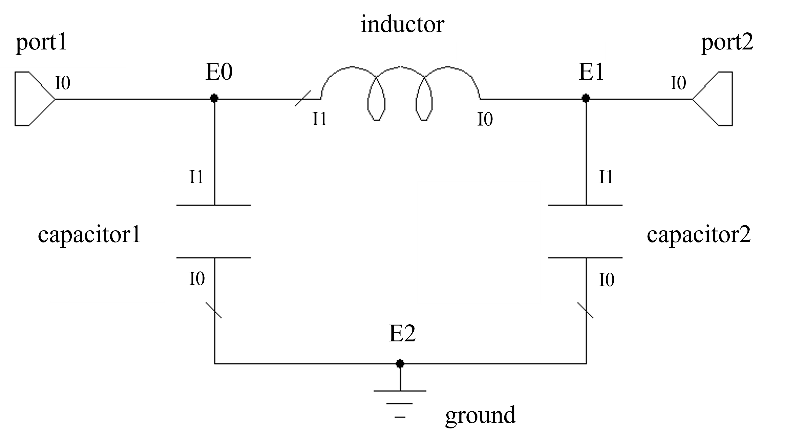

Introduction
=====================

**ParamRF** provides a declarative circuit modelling interface that compiles circuit models using *JAX*. This page provides in introduction into how models are created, and an overview of the fitting procedures.

Core Concepts
~~~~~~~~~~~~~~~~~~~~

The library revolves around a few key building blocks:

* ``pmrf.Model``: The base class for any computable circuit component. Model methods such as *s*, *a* can be used to define model S-parameters, ABCD-parameters etc. and all accept frequency as input. On the other hand, *__call__* can be overridden to return a model instance itself. Models can be defined using composition such as cascading existing models, or via inheritance of the model class itself.
* ``pmrf.Parameter``: A parameter in a circuit model, storing its value as well as any parameter *metadata*. This allows for parameter bounds and scaling, provides the ability to mark parameters as *fixed*, and can have a prior associated with it for Bayesian fitting.
* ``pmrf.Frequency``: A wrapper around a JAX array that defines the frequency axis over which models are evaluated.

Model Composition
~~~~~~~~~~~~~~~~~~~~
**ParamRF** provides a small component library with commonly-used models such as lumped and distributed elements. Models can be built directly using these in a compositional approach.

Cascaded Models
^^^^^^^^^^^^^^^^^^^
For simple circuit element chains, the ** operator can be used to cascade several models together.

The example below creates an RLC filter and terminates it in an open circuit. The resultant ``rlc`` is a first-class ``Model`` of type ``pmrf.models.containers.Cascade``, consisting of parameters representing the respective *R*, *L* and *C* parameters. The S11 is then plotted using matplotlib.

.. code-block:: python

    import pmrf as prf
    from pmrf.models import Resistor, Inductor, ShuntCapacitor, OPEN
    from pmrf.parameters import Fixed

    # Instantiate the lumped element models
    resistor = Resistor(R=100.0, name="res")
    inductor = Inductor(L=2e-9)
    capacitor = ShuntCapacitor(C=1e-12)

    # Cascade the models, storing the result, and a terminated version with fixed R
    rlc = resistor ** inductor ** capacitor
    terminated_rlc = rlc.terminated(OPEN).with_params(res_R=Fixed(90.0))

    # Plot the S11 of the terminated model directly using matplotlib
    import matplotlib.pyplot as plt
    freq = prf.Frequency(1, 1000, 1000, 'MHz')
    s11 = terminated_rlc.s_db(freq)[:,0,0]
    plt.plot(freq.f_scaled, s11)

Circuit Models
^^^^^^^^^^^^^^^^^^^
For complex circuits, ParamRF offers the ability to combine models in any desired configuration using the ``Circuit`` class. This class accepts a list of "connections". Each entry in this list is a node in the circuit. Each node is another list, with each element being a tuple for each connected circuit element or sub-model. Each tuple then contains the model object, as well as the index of the port for that model that is connected in that node.

The following example uses this method to define a two-port PI-CLC network. "External" nodes (each entry in the outer list) are numbered as E0, E1 etc. whereas "internal" port indices (ports for each model in the circuit) are numbered per element as I0, I1 etc. The model is then converted to a scikit-rf network and plotted.

.. code-block:: python

    import pmrf as prf
    from pmrf.models import Capacitor, Inductor, Circuit, Port, Ground

    # Instantiate the elements, ports and grounds
    capacitor1, capacitor2 = Capacitor(C=2e-12), Capacitor(C=1.5e-12)
    inductor = Inductor(L=3e-9)
    port1, port2 = Port(), Port()
    ground = Ground()

    # Create the connections list
    connections = [
        [(port1, 0), (capacitor1, 1), (inductor, 1)], # E0
        [(port2, 0), (capacitor2, 1), (inductor, 0)], # E1
        [(ground, 0), (capacitor1, 0), (capacitor2, 0)], # E2
    ]

    # Create the model and convert it to a scikit-rf Network at a desired frequency, ploting S21
    pi_clc = Circuit(connections)
    pi_clc_skrf = pi_clc.to_skrf(prf.Frequency(1, 1000, 1001, 'MHz'))
    pi_clc_skrf.plot_s_db(m=0, n=0)

Model Inheritance
~~~~~~~~~~~~~~~~~~~~
For more complex models (such as equation-based ones), users can inherit directly from the ``Model`` class and override one of the network properties (such as ``s``, ``a``, or ``y``) or the ``__call__`` method.

Any attributes of a model are classified as either *static* or *dynamic*. By default, fields of built-in types such as ``str``, ``int``, ``list`` etc. are seen as static in the model hierarchy, whereas those annotated as a ``Parameter`` or ``Model`` are dynamic and can be adjusted (for example, by fitting routines).

Note that parameter initialization is flexible: parameters may be populated with a simple float value; using factory methods such as ``Uniform``, ``Normal`` or ``Fixed``; or directly using the ``Parameter`` class constructor.

Equation-based Models
^^^^^^^^^^^^^^^^^^^
The following example demonstrates custom model definition by defining a capacitor from first principles. Here, one of the typical network properties, such as ``s``, ``a``, ``y`` etc., must be overriden, returning the resultant matrix directly.

.. code-block:: python

    import jax.numpy as jnp
    import pmrf as prf

    # Define a model class. Behaviour is defined by implementing 
    # a primary matrix function such as "s" in this case.
    class Capacitor(Model):
        C: prf.Parameter = 1.0e-12

        def s(self, freq: Frequency) -> jnp.ndarray:
            w = freq.w
            C = self.C

            z0 = z0_1 = self.z0
            denom = 1.0 + 1j * w * C * (z0_0 + z0_1)
            s11 = (1.0 - 1j * w * C * (jnp.conj(z0_0) - z0_1) ) / denom
            s22 = (1.0 - 1j * w * C * (jnp.conj(z0_1) - z0_0) ) / denom
            s12 = s21 = (2j * w * C * (z0_0.real * z0_1.real)**0.5) / denom

            return jnp.array([
                [s11, s12],
                [s21, s22]
            ]).transpose(2, 0, 1)

Circuit Models
^^^^^^^^^^^^^^^^^^^
Sometimes it is still convenient to inherit from ``Model`` while still building the model using cascading or ``Circuit``. In this case, the model can be built from sub-models fields/attributes, and returned by overriding the ``__call__`` method.

The following example creates a PI-CLC model once again, but using the above method. Note how certain parameters can be given initial parameters, bounds or fixed to a constant (useful for fitting).

.. code-block:: python

    import jax.numpy as jnp
    import pmrf as prf
    from pmrf.models import Capacitor, Inductor, Circuit, Port, Ground
    from pmrf.parameters import Uniform, Fixed

    class PiCLC(Model):
        capacitor1: Capacitor = Capacitor(C=Fixed(1.0e-12))
        capacitor2: Capacitor = Capacitor(C=Uniform(0.0, 10.0, value=2.0, scale=1e-12))
        inductor: Inductor = Inductor(C=Uniform(0.0, 10.0, value=2.0, scale=1e-12))

        def __call__(self) -> Model:
            # Instantiate the ports and grounds
            port1, port2, ground = Port(), Port(), Ground()

            # Create the connections list. This time, capacitor1, capacitor2 and inductor are members.
            connections = [
                [(port1, 0), (self.capacitor1, 1), (self.inductor, 1)], # E0
                [(port2, 0), (self.capacitor2, 1), (self.inductor, 0)], # E1
                [(ground, 0), (self.capacitor1, 0), (self.capacitor2, 0)], # E2
            ]

            # Return the model
            return Circuit(connections)

Fitting
~~~~~~~~~~~~~~~~~~~~

A primary application of ``pmrf`` is the fitting of models and their parameters to measured data. The ``pmrf.fitting`` module provides a unified interface to perform this task using either traditional *frequentist* optimization, or *Bayesian* inference techniques.

The general workflow consists of defining a model, loading data via *scikit-rf*, and configuring and running the fitter with the specified settings.

Main Fitters
^^^^^^^^^^^^^^^^^^^^

* ``ScipyMinimizeFitter``: Provides access to gradient-based and gradient-free optimization algorithms from ``scipy.optimize``. This includes algorithms such as *SLSQP*, *Nelder-Mead* and *L-BFGS*.
* ``PolychordFitter``: Enables Bayesian inference through nested sampling. This approach provides maximum likelihood parameter values, as well as full posterior probability distributions and Bayesian evidence useful for model comparison and uncertainty quantification.

Fitting Example
^^^^^^^^^^^^^^^^^^^^

The following provides a complete example of fitting the built in ``CoaxialLine`` model to the measurement of 10m coaxial cable (provided as an example in the `GitHub <https://github.com/paramrf/paramrf/tree/main/examples>`_). Data is loaded using scikit-rf; the model is instantiated with appropriate initial parameters; the fitter is configured with a custom cost function and subsequently run; and results are plotted.

.. code-block:: python

    import jax.numpy as jnp
    import skrf as rf

    import pmrf as prf
    from pmrf.models import CoaxialLine
    from pmrf.parameters import Uniform, Fixed, PercentNormal
    from pmrf.fitting import ScipyMinimizeFitter

    # Load the measured data and setup the model
    measured = rf.Network('data/10m_cable.s2p', f_unit='MHz')
    model = CoaxialLine(
        din = PercentNormal(1.12, 5.0, scale=1e-3),
        dout = PercentNormal(3.2, 5.0, scale=1e-3),
        epr = PercentNormal(1.45, 5.0, n=2),
        rho = PercentNormal(1.6, 5.0, scale=1e-8),
        tand = Uniform(0.0, 0.01, value=0.0, scale=0.01, n=2),
        mur = Fixed(1.0),
        length = PercentNormal(10.0, 5.0),
        epr_model='bpoly',
        tand_model='bpoly',
    )

    # Initialize the fitter. We fit on the real and imaginary "features",
    # and combine their results using a custom cost function
    fitter = ScipyMinimizeFitter(
        model=model,
        measured=measured,
        features=['s11_re', 's11_im'],
        cost=[prf.l2_norm_ax0, jnp.mean, prf.mag_2_db],
    )

    # Run the fit. Arguments are passed through to the underlying solver
    results = fitter.run(method='Nelder-Mead')

    # Convert the model to an skrf Network and plot the resultant S11
    model_ntwk = results.model.to_skrf(measured.frequency)
    model_ntwk.plot_s_db(m=0, n=0, ax=axes[0])
    measured.plot_s_db(m=0, n=0, ax=axes[0])

Sampling
~~~~~~~~~~~~~~~~~~~~

A secondary application of ``pmrf`` is the random sampling or simulation of models using e.g. Latin Hypercube sampling.

The below example demonstrates a very simple example of simulating 10 different resistor networks with uniform resistance between 9 and 11 ohms.

.. code-block:: python

    import pmrf as prf
    from pmrf.models import Resistor
    from pmrf.parameters import Uniform
    from pmrf.sampling import LatinHypercubeSampler

    resistor = Resistor(R=Uniform(9.0, 11.0))
    sampler = LatinHypercubeSampler(resistor)
    resistors = sampler.generate_models(10)
    freq = prf.Frequency(10, 20, 100, 'MHz')

    for i, res in enumerate(resistors):
        res.export_touchstone(freq, f'resistors_{i}')