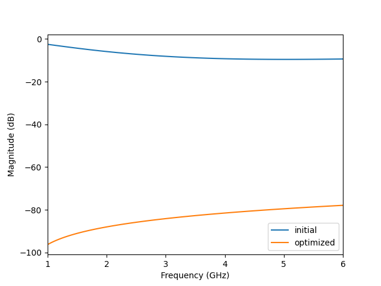

# Summary

ParamRF is an open-source Python framework for the efficient, parametric modeling of radio frequency (RF) circuits and surrogates. The library provides a declarative, object-oriented API, allowing for the composition of deep, nested circuits and the definition of custom models via inheritance. Building on top of the JAX computational ecosystem [@jax2018], models are represented as pure functions with immutable data alongside. This architecture allows the library to make use of JAX's just-in-time (JIT) compilation to modern hardware (CPU, GPU, TPU), as well as its vectorization and automatic differentiation transformations. Using ParamRF's built-in minimization and Bayesian sampling interface, this enables high-performance optimization, advanced parameter extraction, and new design opportunities.

# Statement of Need

The use of radio frequency circuit models is central to fields such as high-frequency electronics, power systems, and semiconductor design. A core engineering requirement in these domains is the creation of parametric circuit models that must be optimized to satisfy specific design goals or fit to measured data. 

Currently, researchers and RF engineers often rely on commercial, GUI-driven tools. While powerful, these tools typically lack a flexible programmatic interface, making it difficult to define custom error functions, automate routines, or integrate with modern statistical solvers. Conversely, standard script-based approaches (often built on libraries like NumPy) can introduce significant performance overhead due to interpreter context switching and dynamic memory allocation. Furthermore, they lack the ability to compute exact analytical gradients, forcing optimizers to rely on slower, error-prone numerical differentiation.

Within the open-source community, `scikit-rf` [@scikit-rf] serves as an industry standard for microwave network creation and analysis. However, its primary design is data-driven, storing S-parameter matrices and frequency arrays directly. ParamRF is designed to complement and not replace `scikit-rf` by filling the gap for parameter-focused optimization. It provides an architecture where the core primitives are parametric models as opposed to matrix data containers, allowing the easy creation of complex hierarchical circuits which can be compiled, differentiated and optimized. Models can then optionally be converted to `scikit-rf` networks after simulation in ParamRF, providing integration with the rest of the Python RF ecosystem.

# Architecture and Features

ParamRF utilizes a unique approach to circuit modeling via a functional programming paradigm within an object-oriented syntax:

- **JAX-Native:** The core primitives, `pmrf.Model` and `pmrf.Frequency`, are both JAX PyTrees and Python dataclasses. Models are strictly immutable and "lazy" i.e., they do not store evaluated matrices but rather represent the pure functions and parameter definitions used to compute their network responses. This provides compatibility with the XLA (Accelerated Linear Algebra) compiler.
- **Declarative Syntax:** Users can define deep, hierarchical structures through a self-documenting syntax. Models can be easily nested and combined using either operator overloading (e.g., using the `**` operator for two-port cascading) or the `pmrf.models.Circuit` class for general circuit topologies.
- **Autodifferentiation:** Because the framework is built on JAX, exact mathematical derivatives of circuit responses (such as S-parameters) can be calculated with respect to both frequency and component parameters. This provides gradient-based solvers with exact Jacobians, and also allows for advanced circuit analysis.
- **Vectorization:** Built-in compatibility with `jax.vmap` allows for the evaluation of large batches of models in parallel without relying on Python `for` loops.
- **Advanced Constraints:** Parameters can be constrained, tied together, or assigned prior probability distributions via "unwrapping".
- **Built-in Solvers:** The framework provides high-level sub-modules (`pmrf.optimize`, `pmrf.infer`, `pmrf.fitting`) that abstract different solver backends. Users can easily use the same model to swap between frequentist optimization (using SciPy or Optimistix) and Bayesian statistical inference (using BlackJAX) to perform parameter estimation and uncertainty quantification.


# Example Usage

The following snippet demonstrates ParamRF's declarative syntax and optimization API. A standard RLC circuit is composed using operator overloading, and the component values are optimized to meet a specified $S_{11}$ reflection goal over a target frequency passband.

```python
import pmrf as prf
from pmrf.models import Resistor, Inductor, Capacitor

# Compose a nested circuit using operator overloading (cascade)
model = Resistor(50) ** Inductor(1.0e-9) ** Capacitor(1.0e-12)

# Define optimization goal and passband
goal = prf.evaluators.Goal('s11_db', '<', -20)
passband = prf.Frequency(3, 4, 101, 'GHz')

# Minimize the goal using a built-in solver
result = prf.optimize.minimize(
    objective=goal,
    model=model,
    frequency=passband,
    solver=prf.optimize.NelderMead(),
)

# Evaluate and plot the initial and optimized model over a wider band
plot_freq = prf.Frequency(1, 6, 101, 'GHz')
model.plot_s_db(plot_freq, m=0, n=0, label='initial')
result.model.plot_s_db(plot_freq, m=0, n=0, label='optimized')
```



# Acknowledgements

We acknowledge the developers of JAX, Equinox [@kidger2021equinox], and the broader open-source scientific Python community that made this framework possible. 

# References